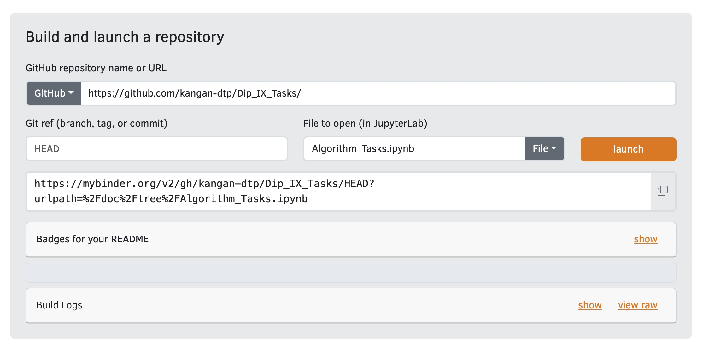
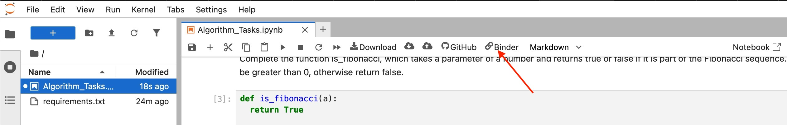
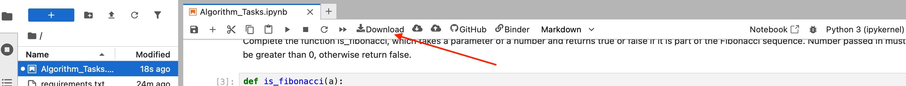
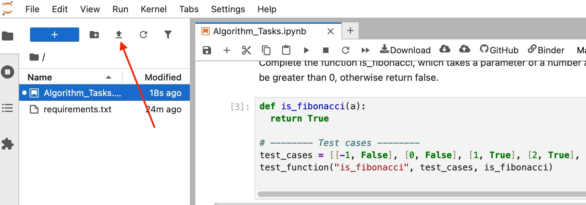

# Instructions

1. go to [MyBinder](https://mybinder.org)
2. Enter *https://github.com/kangan-dtp/Dip_IX_Tasks/* into the GitHub textbox
3. Enter *Algorithm_Tasks.ipynb* into the File textbox
4. click launch

5. A re-usble link to the Jupyter notebook can be found at:

6. To save your work you'll need to download the Jupyter file

7. To resume working on the file you'll need to upload the file and reload the window

